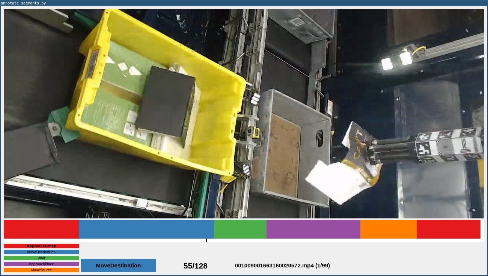

A tool to annotate temporal segments in untrimmed videos with activity classes. This can be used, for example, to label videos used for [temporal action segmentation](https://arxiv.org/abs/2210.10352). The resultant annotation is a class label for each frame of the video.



## Requirements
* OpenCV
* PyQt5
* Matplotlib

## Usage
```
python annotate_segments.py [-h] [-r ROOT] [-t TRIAL_NUM] [-f {npy,json}]
```

-r (required): path containing the videos to be annotated

-t (optional): video number to skip to

-f (optional, default=npy): annotations can be saved as a json dictionary or a Numpy array. The numpy array consists of a class ID per frame. The json dictionary consists of the start and end of each segment and the class name.

Class labels can be defined in [config.json](config.json).

## Keyboard shortcuts

```
j           increment label selection
k           decrement label selection
e           end current segment using selected label

a           apply current label to current segment
x           delete current segment

<spacebar>  play/pause
l           next frame
h           previous frame
$           last frame
0           first frame

n           next trial
b           next unlabelled trial

q           quit
s           save
```

## Similar tools
Both of these tools can be used to label video segments, but can do other labelling tasks as well:

* [VGG Image Annotator (VIA)](https://www.robots.ox.ac.uk/~vgg/software/via/)
* [Behavioral Observation Research Interactive Software (BORIS)](http://www.boris.unito.it/)
